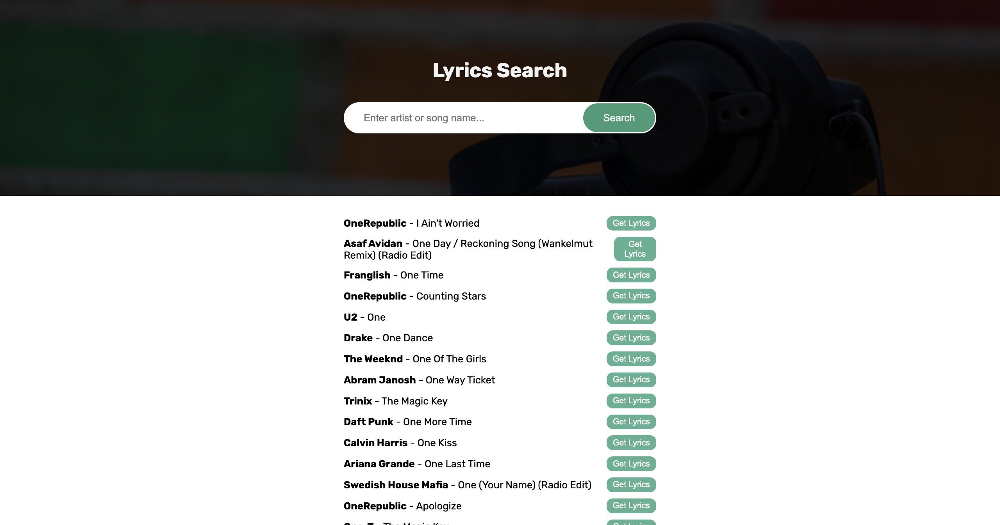
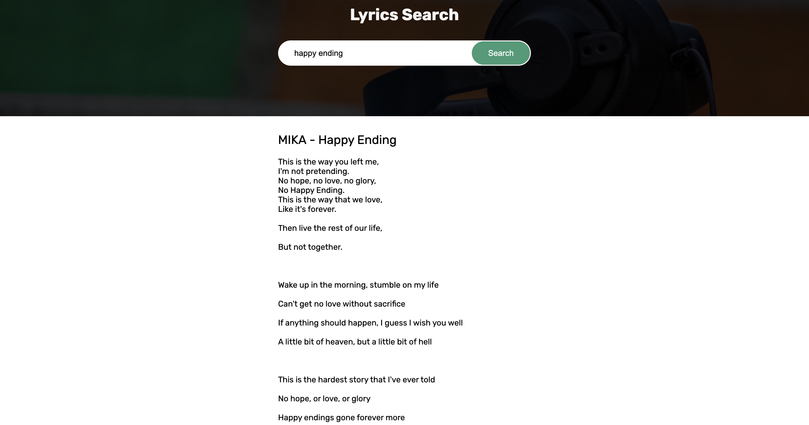

# Lyrics Search App

The **Lyrics Search App** is a web-based application that allows users to search for songs and view their lyrics. It uses the [Lyrics.ovh API](https://lyricsovh.docs.apiary.io/) to fetch song suggestions and lyrics. The app provides a clean and responsive interface for an enhanced user experience.
 
## Live Demo

You can try the live demo of the Lyrics Search App [here](#).

## Screenshots

### Search Interface

### Lyrics Display

## Features

- Search for songs by entering the artist's name or song title.
- View a list of song suggestions based on the search term.
- Fetch and display the lyrics of a selected song.
- Pagination support for navigating through multiple search results.
- Responsive design for mobile and desktop devices.
- Toast notifications for errors or invalid inputs.

## Technologies Used

- **HTML**: For structuring the application.
- **CSS**: For styling and responsive design.
- **JavaScript**: For handling API requests and interactivity.
- **Lyrics.ovh API**: For fetching song suggestions and lyrics.

## How to Use

1. Open the app in your browser.
2. Enter the artist's name or song title in the search bar.
3. Click the **Search** button to fetch song suggestions.
4. Click the **Get Lyrics** button next to a song to view its lyrics.
5. Use the **Prev** and **Next** buttons to navigate through multiple search results.

## Project Structure

GitHub Copilot
Lyrics Search App/ ├── index.html # Main HTML file ├── style.css # Stylesheet for the app ├── script.js # JavaScript file for app logic ├── assets/ # Folder for images and other assets (if any) └── readme.md # Project documentation

## How to Run the Project

1. Clone the repository or download the project files.
2. Open the `index.html` file in your browser.
3. Start searching for songs and lyrics!

## Future Improvements

- Add support for saving favorite songs and lyrics.
- Implement a dark mode toggle for better user experience.
- Add a feature to share lyrics on social media platforms.
- Improve error handling for network issues.

## About the Author

This project was created by **Aryan Raj**, a passionate web developer with a keen interest in building interactive and user-friendly web applications. Aryan enjoys exploring new technologies, solving problems, and creating projects that help others learn and grow in the field of web development.

You can connect with Aryan on:

- [GitHub](https://github.com/geeksaryan)  
- [LinkedIn](https://linkedin.com/in/aryan-kumar-220791278)  
- [Twitter](https://x.com/aryanraj7981)

Feel free to reach out for collaboration or to share feedback on this project!

## License

This project is open-source and available under the [MIT License](https://opensource.org/licenses/MIT).

---
Enjoy searching for your favorite lyrics!